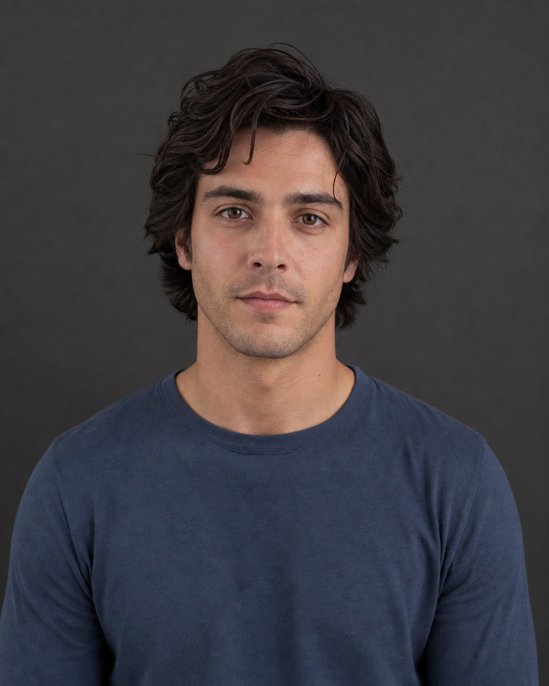
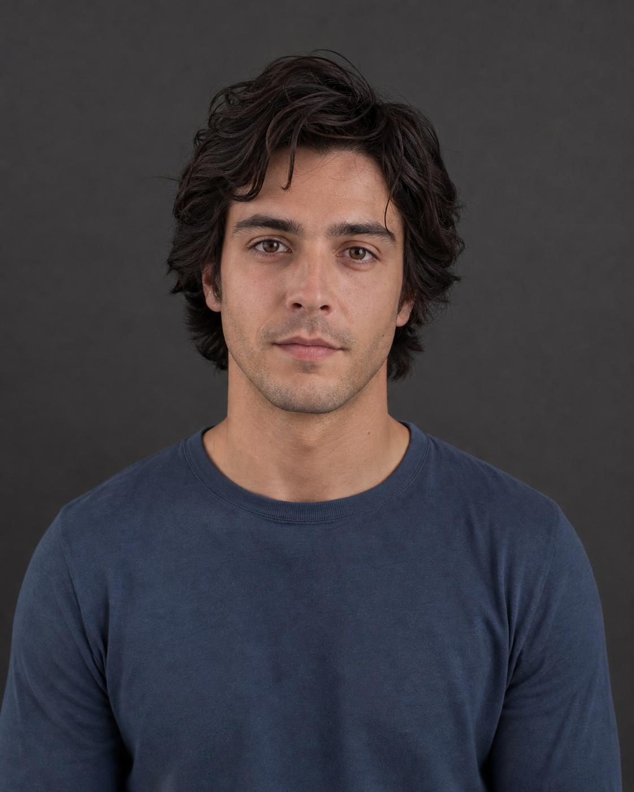
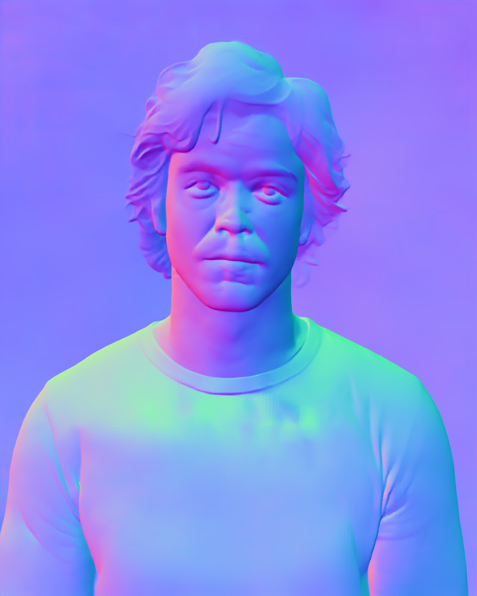
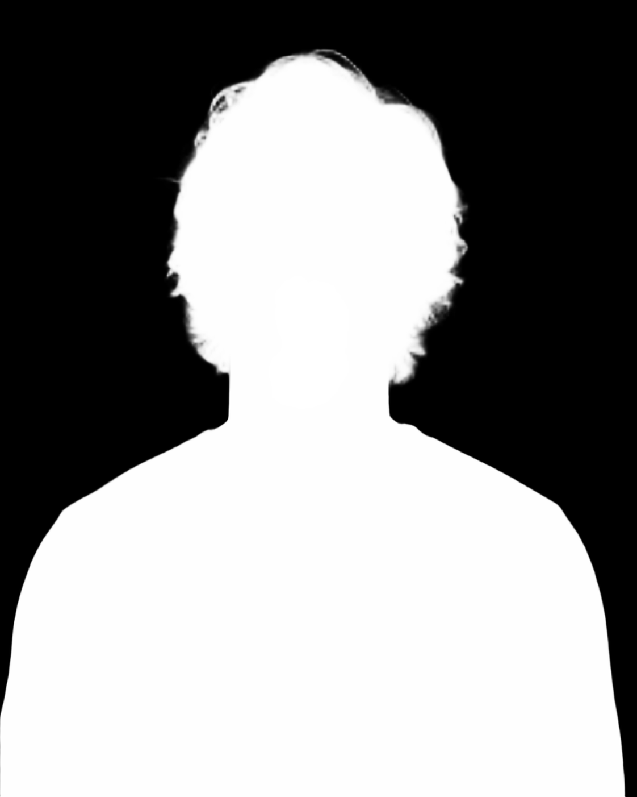
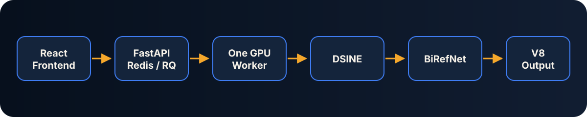
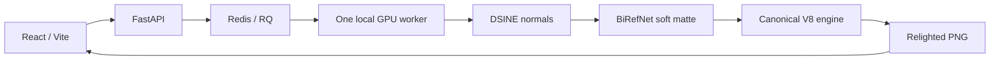

# Sunit — Geometry-Aware Single-Image Portrait Relighting

Sunit changes the apparent light direction in a portrait by combining DSINE
surface normals, a BiRefNet soft subject matte, and a region-aware ratio
relighting engine.

> Sunit is currently a local research application. DSINE's license limits use
> to non-commercial, internal, or academic research unless a separate
> commercial license is obtained from Imperial College London. Review
> [Credits and licensing](#credits-and-licensing) before distributing or
> commercializing a derivative.

## Demo

The person below is fully synthetic. The “after” image was generated by the
real Sunit pipeline with the Natural preset; it is not an image-generation
mockup.

| Original | Relighted |
| --- | --- |
|  |  |

<details>
<summary>Intermediate geometry and matte</summary>

| DSINE normal map | BiRefNet person alpha |
| --- | --- |
|  |  |

</details>

For this tracked demo, the measured mean background change was exactly
`0.00000000`; the foreground mean change was `0.01237711`.

## Why Sunit

A single photograph already contains shadows, highlights, and directional
lighting. Applying a new Lambertian shading map directly tends to double-light
the image, damage faces, and leak changes into the background.

Sunit instead:

1. estimates surface geometry with DSINE;
2. isolates the person with a soft BiRefNet alpha matte;
3. estimates an approximate intrinsic/albedo signal from the old shading;
4. applies a controlled old-to-new shading ratio;
5. limits shadow removal, specular response, and boundary relighting; and
6. restores the original background exactly when background lock is enabled.

## Architecture





All generated job data is kept under `app/storage/jobs/<job_id>/`. Public API
responses contain relative URLs, never internal filesystem paths.

## Features

- one-image automatic portrait workflow;
- geometry-aware light-direction control;
- soft hair and clothing boundaries;
- exact background restoration;
- Natural, Soft Portrait, and Dramatic presets;
- asynchronous GPU work through Redis and RQ;
- real stage/progress reporting;
- responsive before/after comparison and result download;
- optional normal, matte, and engine debug outputs;
- preserved advanced image-plus-normal endpoint.

## Technology

Python 3.10, FastAPI, Redis, RQ, PyTorch, DSINE, BiRefNet, NumPy, OpenCV,
Pillow, React, and Vite.

## Requirements

- Linux host;
- Python 3.10;
- Node.js 20+ and npm;
- Docker with the Compose plugin (Redis only);
- NVIDIA GPU and a CUDA-enabled PyTorch build (strongly recommended);
- about 4 GB or more of available GPU memory;
- a local DSINE checkout and its `dsine.pt` checkpoint.

The verified machine uses an NVIDIA GeForce RTX 3050 Laptop GPU with one RQ
worker. Do not start multiple CUDA workers on a 4 GB GPU.

## Setup

```bash
git clone https://github.com/Sattei/Sunit.git
cd Sunit

python3.10 -m venv app/.venv
source app/.venv/bin/activate
python -m pip install --upgrade pip
```

Install a CUDA-enabled PyTorch build appropriate for the host by following the
[official PyTorch installer](https://pytorch.org/get-started/locally/), then
install Sunit:

```bash
python -m pip install -r app/requirements/dev.txt
npm ci --prefix app/frontend
```

Clone DSINE:

```bash
git clone https://github.com/baegwangbin/DSINE.git external/DSINE
```

Follow the [official DSINE checkpoint instructions](https://github.com/baegwangbin/DSINE#step-1-test-dsine-on-some-images-requires-minimal-dependencies)
and place the model here:

```text
external/DSINE/projects/dsine/checkpoints/exp001_cvpr2024/dsine.pt
```

The BiRefNet model
[`ZhengPeng7/BiRefNet_lite-matting`](https://huggingface.co/ZhengPeng7/BiRefNet_lite-matting)
is downloaded to the Hugging Face cache on first use.

## Run locally

Start Redis, one local CUDA worker, FastAPI, and Vite:

```bash
make dev-up
```

Open:

```text
http://localhost:5173
```

The API is at `http://localhost:8000`. Logs and owned PID records are stored
under `.runtime/`.

Check every service:

```bash
make health
```

Stop only the processes recorded by this Sunit checkout:

```bash
make dev-down
```

If ports 8000 or 5173 are occupied, startup reports the owning process and
exits. Override them with `SUNIT_API_PORT` and `SUNIT_FRONTEND_PORT`.

## API

| Method | Route | Purpose |
| --- | --- | --- |
| `GET` | `/health` | Redis, GPU, model-path, and DSINE diagnostics |
| `POST` | `/api/relight-auto` | Primary one-image production workflow |
| `GET` | `/api/jobs/{job_id}` | Job status, stable stage, and progress |
| `GET` | `/api/jobs/{job_id}/result` | `202` while running; output URL when done |
| `POST` | `/api/relight` | Advanced image-plus-normal workflow |

Example:

```bash
curl -X POST "http://localhost:8000/api/relight-auto" \
  -F "image=@docs/assets/original-portrait.png" \
  -F "new_x=0.55" \
  -F "new_y=-0.20" \
  -F "new_z=0.80" \
  -F "person_strength=0.65" \
  -F "ambient=0.38" \
  -F "highlight=0.08" \
  -F "preset=natural"
```

Uploads are streamed with a 15 MB limit. Supported formats are JPG, JPEG, PNG,
and WEBP. Each side must be 128–4096 pixels; processing is capped at 1536
pixels on the longest side.

## Testing

Model-free unit and API tests:

```bash
make test
```

Real GPU smoke test:

```bash
make dev-up
make smoke
```

Use a different portrait:

```bash
SMOKE_IMAGE=/absolute/path/to/portrait.jpg make smoke
```

The smoke test submits through the public endpoint, polls the RQ job, downloads
the output, and verifies it with Pillow. Engine acceptance thresholds are:

- background mean absolute change `<= 0.005`;
- foreground mean absolute change `>= 0.001`;
- matching input/output dimensions;
- no NaN or infinite output values.

See [docs/testing.md](docs/testing.md) for verified cases and remaining test
matrix coverage.

## Repository layout

```text
app/backend/                  FastAPI, Redis/RQ queue, worker tasks
app/frontend/                 React/Vite product interface
app/scripts/relight_image.py  Canonical manual CLI wrapper
app/src/pipeline/             Automatic DSINE → BiRefNet → V8 orchestration
app/src/relighting/engine.py  Canonical V8 relighting engine
app/tests/                    Model-free regression and API tests
archive/                      Historical relighting experiments
docs/assets/                  Tracked synthetic demo evidence
scripts/                      Startup, shutdown, health, and smoke tooling
```

## Limitations

- Strong baked-in cast shadows cannot always be removed cleanly.
- Normal-estimation errors directly affect the new shading.
- Hair, transparent materials, and highly reflective surfaces remain hard.
- Multiple people are treated as one foreground matte.
- The primary target is a single clear portrait, not universal photo editing.
- First-run model download and BiRefNet loading add latency.
- A GPU is strongly recommended.
- Full CUDA Docker deployment is not claimed; Docker is used only for Redis in
  the verified local setup.

## Roadmap

- direct in-process DSINE loading;
- selectable subjects in multi-person images;
- color-temperature controls;
- cast-shadow synthesis;
- faster model variants;
- verified CUDA worker image for a fixed deployment target.

## Credits and licensing

- [DSINE](https://github.com/baegwangbin/DSINE), by Gwangbin Bae and Andrew J.
  Davison, supplies surface-normal estimation. Its repository license permits
  non-commercial internal or academic research use and requires separate
  permission for commercial use. The external repository and checkpoint are
  intentionally not committed here.
- [BiRefNet](https://github.com/ZhengPeng7/BiRefNet), by Peng Zheng and
  collaborators, supplies the soft portrait matte. Its source repository and
  the selected Hugging Face model are identified as MIT licensed.
- Sunit's canonical V8 ratio-relighting engine and integration code live in
  this repository. No umbrella project license has been added; obtain legal
  review before redistribution.

The synthetic demo portrait was generated specifically for this repository.
